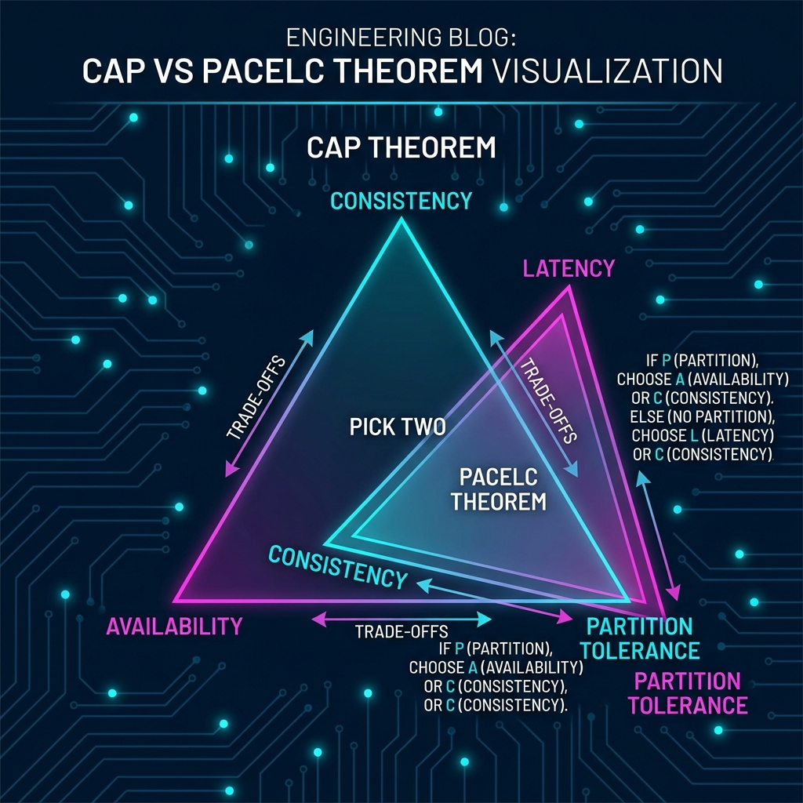

  

## Introduction — The Binary Trap

Ask any junior engineer about distributed databases, and they’ll mention the **CAP Theorem**. It’s the law of the land: pick two. But in production systems at FAANG scale, the CAP theorem is often more of a distraction than a guide. 

The reality is that we rarely choose between Consistency and Availability in a vacuum. Modern engineering is about **graceful degradation** and **latency trade-offs**.

---

## The CAP Limitation: Why Binary Isn't Reality

CAP (Consistency, Availability, Partition Tolerance) only describes behavior during a network partition. But network partitions are rare. Most of the time, the system is running "normally." 

What happens when there is *no* partition? CAP doesn't tell you. This is why we need a better mental model.

### Enter PACELC: The Senior Engineer’s Framework

PACELC extends CAP by looking at both states of a system:

1. **P (If there is a Partition):** Choose between **A (Availability)** or **C (Consistency)**.
2. **E (Else, during normal operation):** Choose between **L (Latency)** or **C (Consistency)**.

If you optimize for consistency, you pay for it in milliseconds. If you optimize for latency, you pay for it in "staleness."

---

## Case Study: DynamoDB and the Quorum Model

Amazon's DynamoDB is the gold standard for high-scale consistency management. It uses a **Quorum-based approach** $(R+W > N)$, where:
- **N:** Total copies (replicas).
- **W:** Acknowledgments required for a successful write.
- **R:** Replicas checked for a successful read.

By tuning these numbers, you can toggle between **Strong Consistency** (high latency) and **Eventual Consistency** (low latency).

> "In a global system, speed of light is your hardest constraint. Consistency is just a choice of how long you're willing to wait for the truth."

---

## Designing for Truth vs. Speed

When designing a system, ask yourself: **"Is a stale read fatal or just annoying?"**
- **Bank Ledger?** Strong consistency is non-negotiable.
- **Instagram Likes?** Eventual consistency is perfect.

### Summary Checklist for Distributed Architects:
1. Identify your primary constraint (Cost, Latency, or Truth).
2. Choose a default consistency level (Eventual by default).
3. Implement "Read-Your-Writes" consistency for a better UX.
4. Use versioning or vector clocks to resolve conflicts.

---

## Conclusion

The evolution from CAP to PACELC represents our industry’s shift from theoretical constraints to operational reality. As a Staff Engineer, your job isn't to follow theorems—it's to navigate the trade-offs that keep the business alive while the light is still traveling between data centers.
