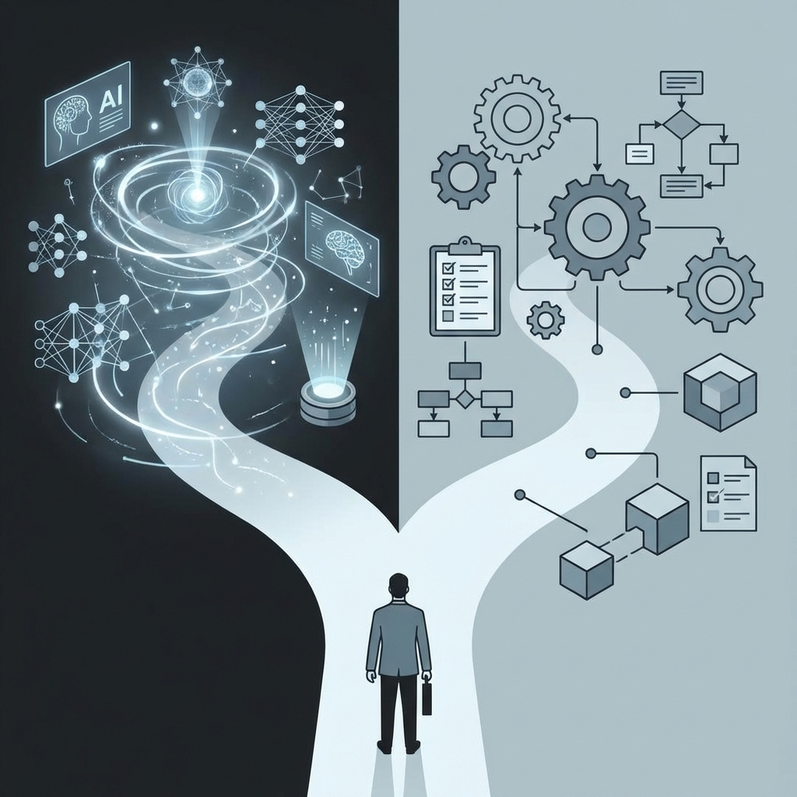

  

## Most Products Never Cross This Line

Almost every startup has a **demo phase**.

It looks like progress:
- Users sign up
- People say “this is cool”
- The product works in isolation

But very few products ever cross the invisible line where users stop *trying* them — and start **depending** on them.

That line is the difference between:
- A product people like  
- And a product people can’t remove  

Most startups die on the wrong side of it.

## The Demo Trap

Demos are designed to impress:
- **Zero setup**
- **Instant output**
- **No commitment required**

They optimize for:
- First impressions
- Shareability
- Speed

And that’s exactly the problem.

A product that requires nothing from the user can never become critical to them.

**Dependence requires friction:**
- Configuration
- Trust
- Integration
- Responsibility

Without those, your product stays optional forever.

## The Dependence Equation

A product becomes unavoidable when **at least one** of these is true:

1. **It holds irreversible state**  
   Data, history, records, or decisions that can’t simply be undone.

2. **It sits inside a critical workflow**  
   Finance, operations, development, compliance, customer handling.

3. **It replaces human judgment at scale**  
   Reviews, approvals, classification, monitoring.

4. **Its absence causes real pain**  
   Costs rise, errors return, speed collapses.

> Demos touch outputs.  
> Dependence touches consequences.

## The Displacement Threshold

Every product exists in a market where the cost of staying (maintenance) is weighed against the cost of leaving (displacement). 

For a demo, the displacement cost is near zero. You stop using it, and life returns to exactly how it was before. For a dependent product, displacement creates a **vacuum**.

**Higher displacement cost comes from:**
- **Regulatory Gravity:** Your tool is now the source of truth for compliance or audits.
- **Inter-team Friction:** Team A uses it to feed Team B. Removing it breaks the social contract of the organization.
- **Embedded Logic:** Your system doesn't just store data; it applies rules that the customer has forgotten how to execute manually.

If your "Value Prop" is just speed, you are easily replaced by a faster tool. If your "Value Prop" is displacement pain, you are a platform.

## The Quiet Moment Dependence Begins

Dependence doesn’t start with applause.

It starts quietly:
- The first automated report that gets trusted
- The first decision made by the system
- The first audit trail no one wants to lose
- The first workflow that now assumes your product exists

Nothing looks exciting — but from this point on, **removal hurts**.

That’s the moment most founders miss.

## Why Founders Avoid Building Dependence

Dependence is uncomfortable.

It:
- Takes longer
- Requires domain depth
- Forces accountability
- Makes failures visible

So founders unconsciously avoid it by:
- Staying “tool-like”
- Avoiding guarantees
- Letting users bear the blame

But real companies are not clever tools.  
They are **accountable systems**.

## The Fork Every Product Reaches

Every startup eventually faces a choice.

### Path 1: Optimize the Demo
- Better prompts
- More features
- Faster output
- Prettier UI

Feels productive.  
Feels safe.  
Leads to churn.

### Path 2: Optimize for Dependence
- Deeper integration
- Fewer users, more usage
- Boring reliability
- Measurable outcomes

Feels slow.  
Feels risky.  
Builds real businesses.

## A Simple Test for Founders

Ask yourself:

- What breaks if users stop using this?
- What irreversible state do we hold?
- What decision does our system make?
- Who gets blamed if it fails — us or the user?

If the answer is always “the user” — you’re still building a demo.

## Designing for Friction (Counter-Intuitive Growth)

Modern SaaS teaches us to "remove all friction." This is great for top-of-funnel, but fatal for long-term retention if taken too far. 

To build dependence, you must strategically *introduce* friction that leads to integration:
- **Mandatory Integrations:** Don't just offer an API; require a webhook to perform a core action.
- **Customized Schemas:** Force users to define how your data fits their world.
- **Certification/Training:** Make the user invest their own identity in mastering your system.

Friction is the tax users pay for stability. If they haven't paid it, they don't value the stay.

## The "AI Wrapper" Survival Guide

In the current market, "AI Wrappers" are often criticized for having zero moat. They are the ultimate demos: easy to build, easy to try, and easy to churn from.

To bridge the gap from a GPT-wrapper to a dependent system:
- **Move from Chat to CRUD:** If your interface is just a text box, you are a tool. If your interface is a dashboard where users manage the *results* of the AI, you are a system.
- **Own the Feedback Loop:** Don't just show an output; allow the user to correct it and store that correction as a unique data asset.
- **Automate the Boring Integration:** Don't ask the user to copy-paste. Connect to their Slack, their Jira, or their DB. The moment you are "the thing that posts to Slack," you are hard to turn off.

## The Founder's Choice

You can spend your time making the demo 10% more "wow," or you can spend it making the integration 10% more "un-removable."

The first gets you likes on X.
The second gets you a trillion-dollar company.

Choose wisely.

## Conclusion

The hardest moment in a startup is not shipping the first version.

It’s the moment you decide to stop impressing users and start **being responsible for them**.

That’s when a product stops being nice to have — and becomes unavoidable.

---

  

