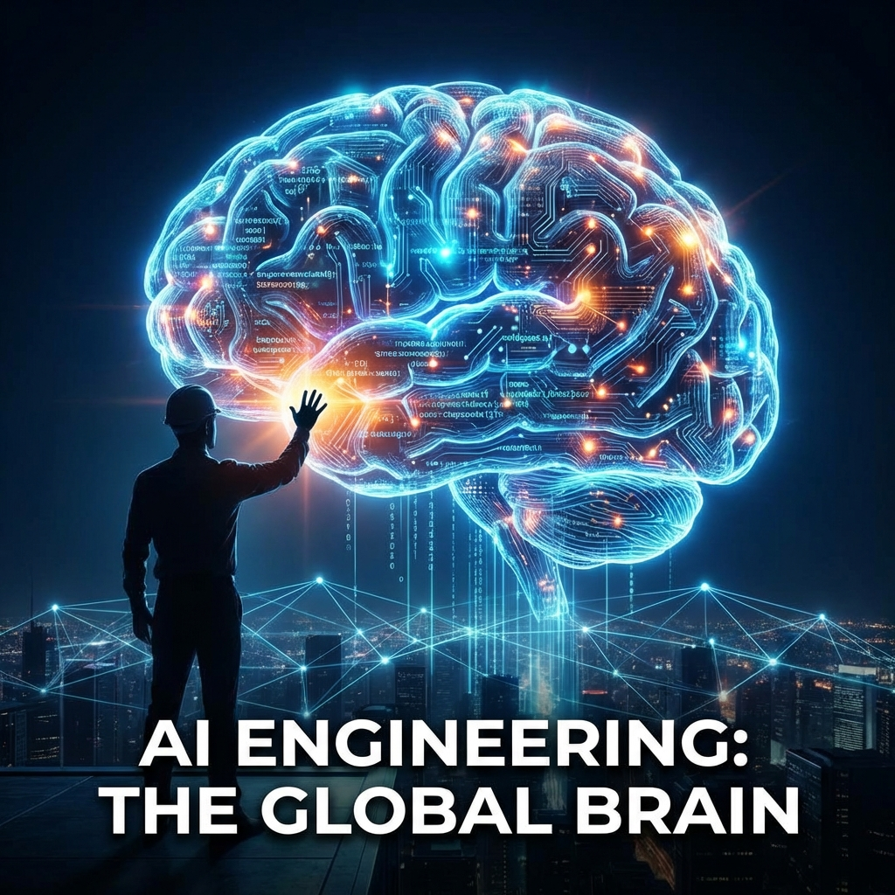

  

## Introduction — The Era of the Scripting AI is Over

In 2023, we were amazed by chat interfaces. In 2024, we obsessed over prompts. By 2026, the industry has realized that "Chatting with AI" is just the interface—the real value is in **AI Orchestration**. 

The transition from "AI as a tool" to "AI as a colleague" marks the shift into **Agentic Engineering**.

---

## Beyond the Chatbox: The Rise of Agentic Workflows

An agent is more than just an LLM with a prompt. It is a system designed to:
- **Reason:** Break down complex goals into sub-tasks.
- **Act:** Use tools (browsers, terminals, APIs) to execute those tasks.
- **Observe:** Check the output and correct itself if something goes wrong.

> "A prompt is a command; an agent is a commitment to a result."

---

## The New Architectural Stack: Cognitive Layers

Implementing AI at scale now requires a multi-layered approach:
1. **The Model Layer:** Providing the raw intelligence (GPT-5, Llama-4).
2. **The Memory Layer:** Vector databases providing long-term recall.
3. **The Tooling Layer:** Standardized APIs that the AI can call reliably.
4. **The Planning Layer:** Orchestration frameworks (LangGraph, CrewAI) that manage the execution flow.

---

## AI Engineering vs. Data Science: The Great Divergence

The "AI Engineer" is not a "Data Scientist." 
- **Data Scientists** focus on weights, biases, and training sets.
- **AI Engineers** focus on context windows, RAG pipelines, and agentic reliability.

As models become commodities, the competitive advantage shifts toThose who can build **reliable systems around unreliable models.**

---

## The Future: Human-in-the-Loop Orchestration

We aren't moving toward "No-Human" systems. We are moving toward **Staff-Level AI** where one engineer manages a fleet of specialized agents.
- **The Architect Agent:** Proposes system designs.
- **The Implementation Agent:** Writes the code.
- **The Verification Agent:** Tests and breaks the system.

The engineer's role becomes one of **Reviewer and Orchestrator**.

---

## Conclusion — Build for Outcomes

The future of AI engineering isn't about knowing the latest model leaderboard. It's about knowing how to stitch together intelligence, tools, and memory to solve a business problem.

Stop asking what the AI can say. Start building what the AI can **do**.

---

© 2026 Ashok Murugan
