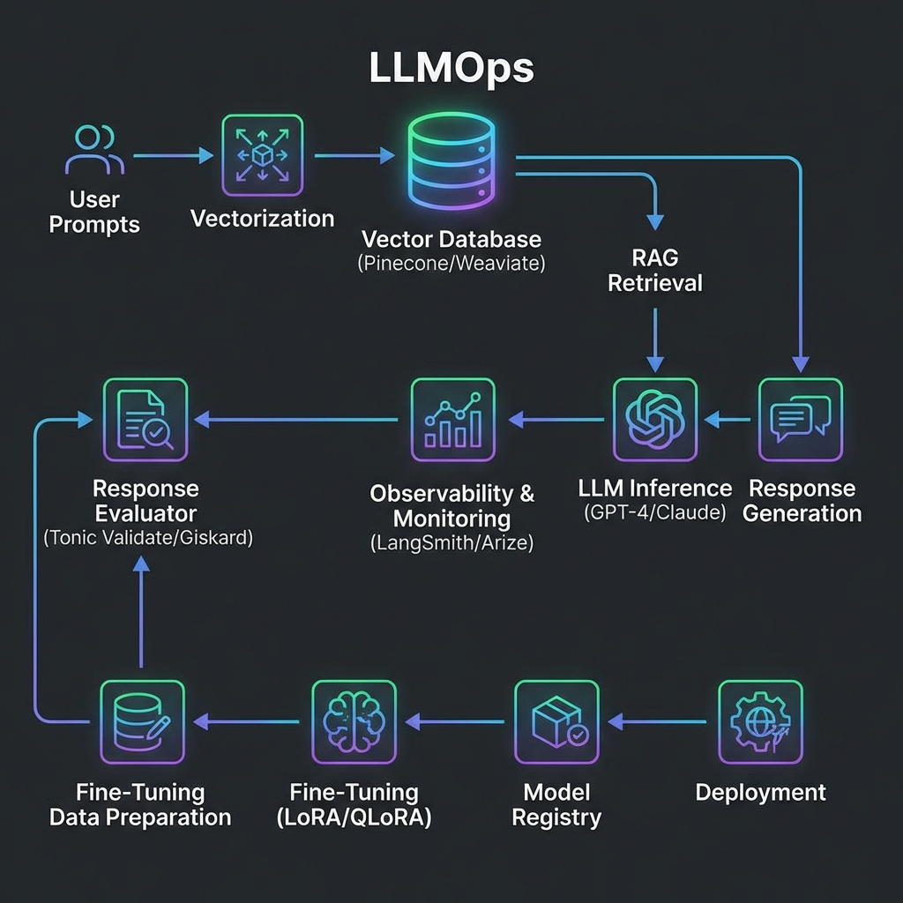

  

## Introduction — The Death of the Weekend Project

In early 2023, LLM applications were simple: a Python script, an OpenAI API key, and a basic UI. By 2026, the "weekend project" architecture has failed. Scaling an LLM application to millions of users is an infrastructure problem, not a modeling problem.

Welcome to **LLMOps**.

---

## The Prototype Trap: Why Your Demo Won't Scale

The biggest mistake teams make is assuming that a "good" chat response in a notebook equals a production-ready feature. Production AI requires solving for:

1. **Non-deterministic outputs:** How do you test something that changes every time?
2. **Context Window Management:** Brute-forcing tokens into a prompt is expensive and slow.
3. **Privacy and Compliance:** You can't just send PII to a third-party API.

### The Emerging Stack

- **Vector Databases:** The "memory" of your LLM (Pinecone, Weaviate, pgvector).
- **Prompt Orchstration:** Managing complex chains of logic (LangChain, Haystack).
- **Evaluation Frameworks:** Using LLMs to grade other LLMs (Tonic, Arize).

---

## RAG vs. Fine-Tuning: The Staff Decision

As a Staff Engineer, the most common question you’ll face is: **"Should we fine-tune our own model or use RAG?"**

| Feature | RAG (Retrieval Augmented Generation) | Fine-Tuning |
| :--- | :--- | :--- |
| **Data Freshness** | Real-time (Retrieved from DB) | Static (Requires retraining) |
| **Hallucination** | Low (Grounds the LLM in facts) | Moderate (Higher risk) |
| **Technical Effort** | Moderate (Infrastructure heavy) | High (Data science heavy) |
| **Cost** | Incremental per request | High upfront training cost |

**Staff Tip:** 90% of business use cases are better served by a robust RAG pipeline than a fine-tuned model.

---

## The Cost of Intelligence: Token Economics

Monitoring LLM apps isn't just about CPU and RAM. It's about **Tokens**.
- **Input Tokens:** The context you provide.
- **Output Tokens:** The answer generated.

Scaling requires aggressive **caching of semantic queries**. If two users ask roughly the same thing, don't re-run the LLM. Use your vector database to serve the previous answer.

---

## Conclusion

LLMOps is the convergence of Software Engineering, Data Engineering, and DevOps. The winners in the next decade of AI won't be those with the best models, but those with the most reliable, observable, and cost-efficient pipelines to serve them.
