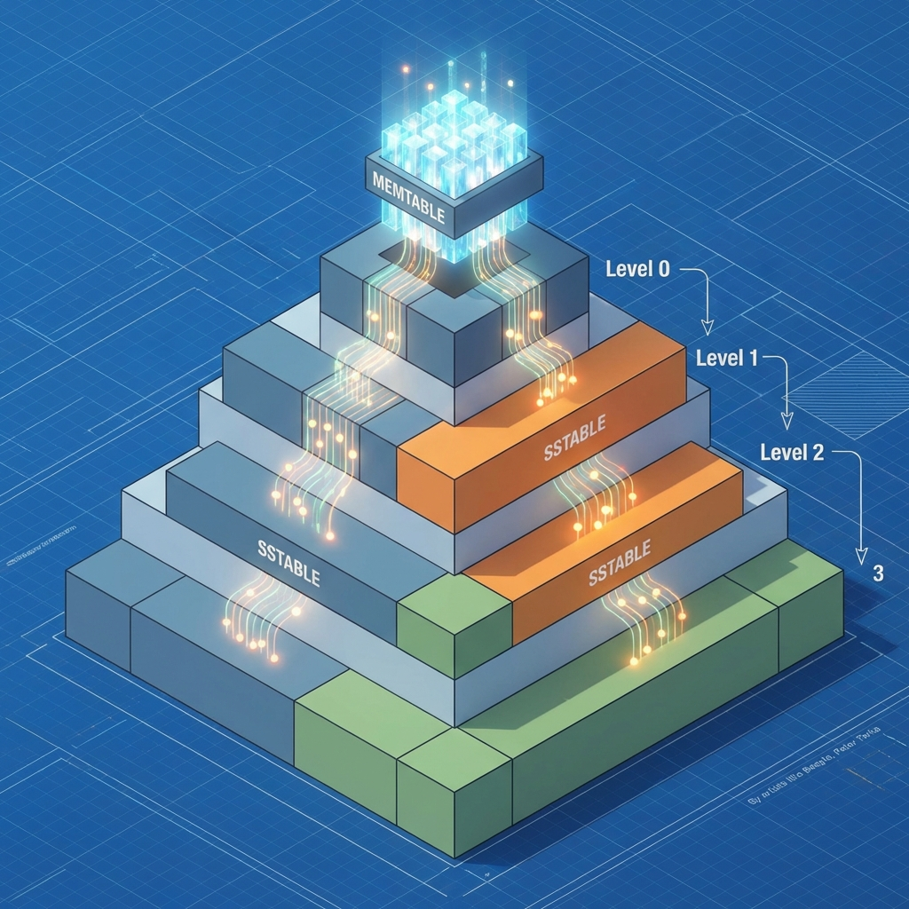

  

## Introduction — The Write vs. Read War

In the world of storage engines, you are always trading one thing for another. For decades, the **B-Tree** was king (MySQL, PostgreSQL). But as we entered the era of Big Data and high-ingestion workloads (Facebook, Uber, Google), the B-Tree's weakness—**Random Write Performance**—became a fatal flaw.

**LSM Trees (Log-Structured Merge Trees)** were the solution.

---

## How LSM Trees Work: The Architecture of Speed

Unlike a B-Tree that updates data in place, an LSM Tree never overwrites. It only appends.

1. **Memtable:** All incoming writes go into an in-memory sorted buffer. It's fast because it's RAM.
2. **SSTables (Sorted String Tables):** When the Memtable is full, it's flushed to disk as an immutable, sorted file.
3. **Compaction:** Since we have many files on disk, a background process "merges" them, removing duplicates and tombstones.

### The Trade-off
- **LSM wins on Writes:** Appending is orders of magnitude faster than random disk updates.
- **B-Tree wins on Reads:** Since data is in one place, finding a single key is generally faster.

---

## Write Amplification: The Silent Performance Killer

As a Staff Engineer choosing a database, you must understand **Write Amplification (WA)**. WA is a measure of how many bytes are written to the physical storage for every byte written by the application. 

LSM Trees have higher WA because of constant "compaction." If not tuned correctly, your database can spend all its disk I/O just "cleaning up" after itself.

> "A database is only as fast as its compaction strategy allows it to be."

---

## Real World Usage: RocksDB

RocksDB (developed at Facebook) is the most famous LSM implementation. It serves as the storage engine for **TiDB**, **CockroachDB**, and parts of **MySQL (MyRocks)**. Its superpower? Thousands of tuning parameters that allow you to shape the database to your specific workload (Read-heavy vs. Write-heavy).

---

## Conclusion

LSM Trees have enabled the scale of the modern web. By transforming random writes into sequential ones, they’ve allowed us to build systems that handle petabytes of ingestion. Understanding whether your workload needs the stability of a B-Tree or the raw throughput of an LSM Tree is a fundamental skill for any system architect.
