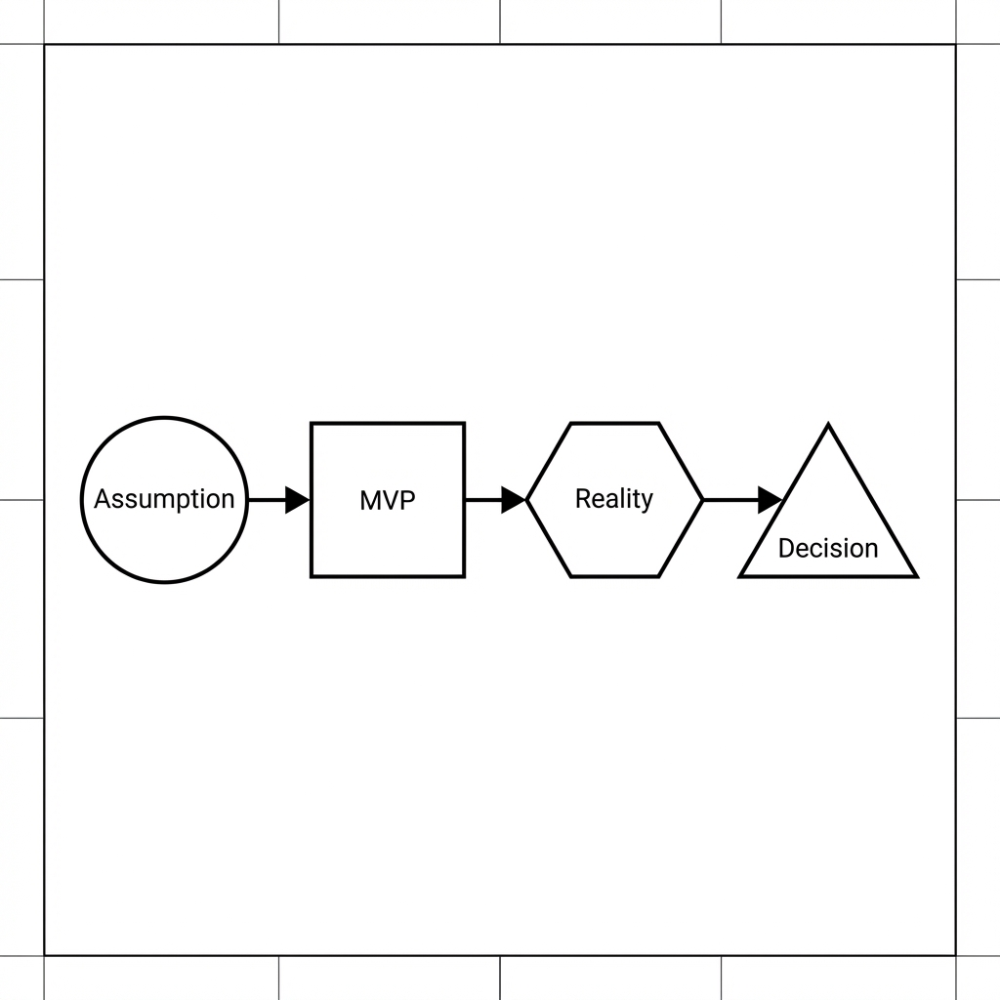
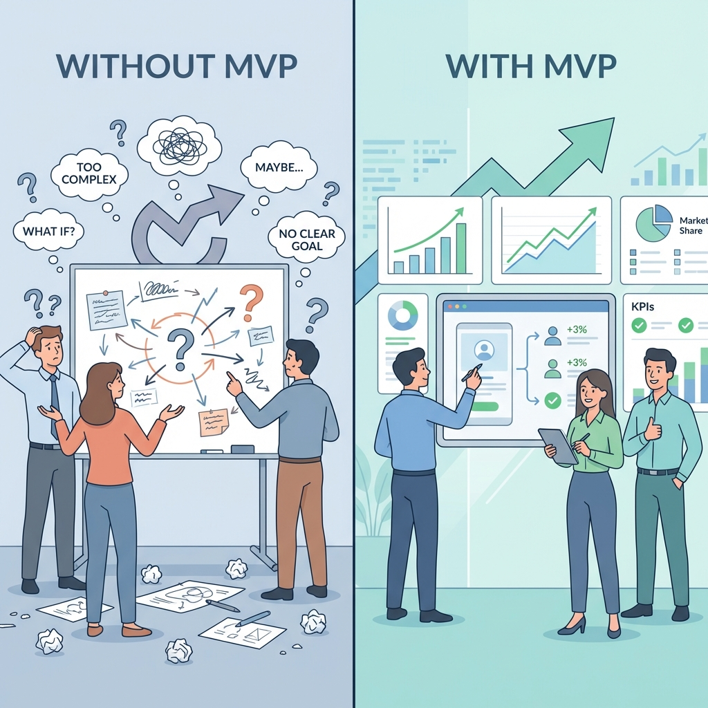
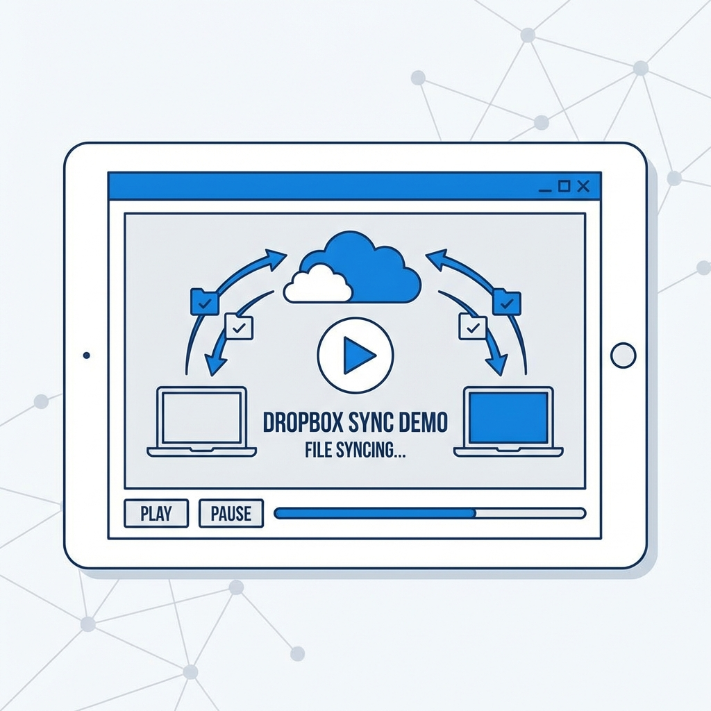
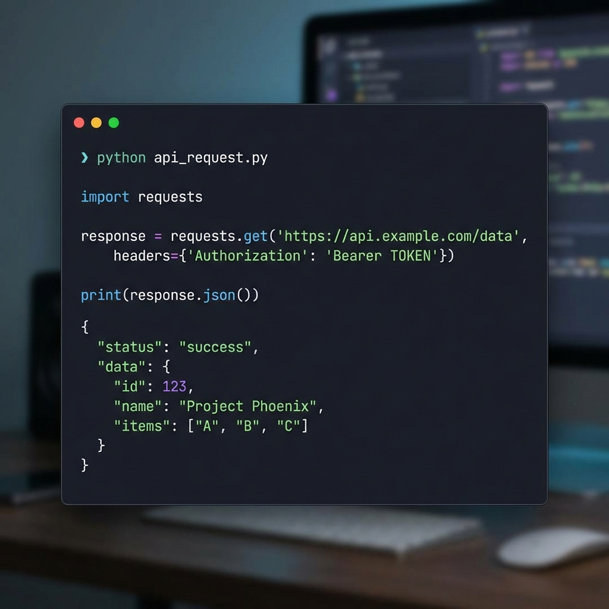
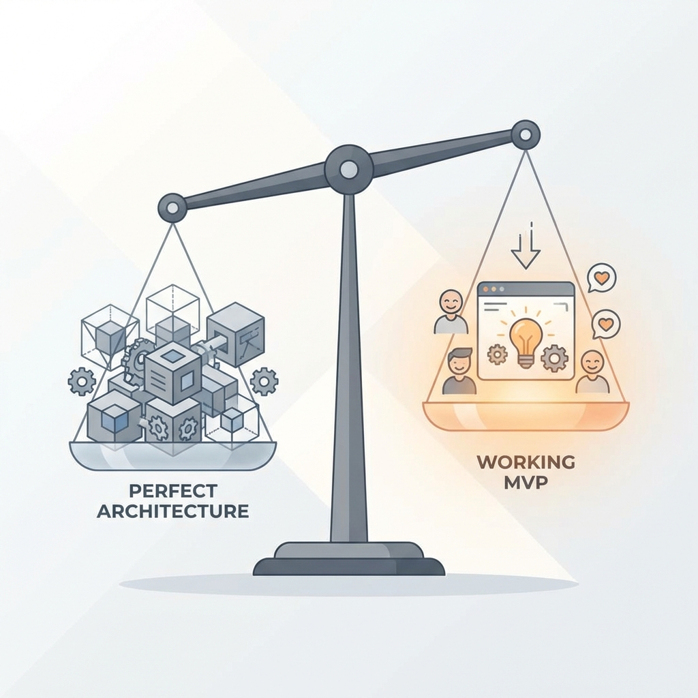
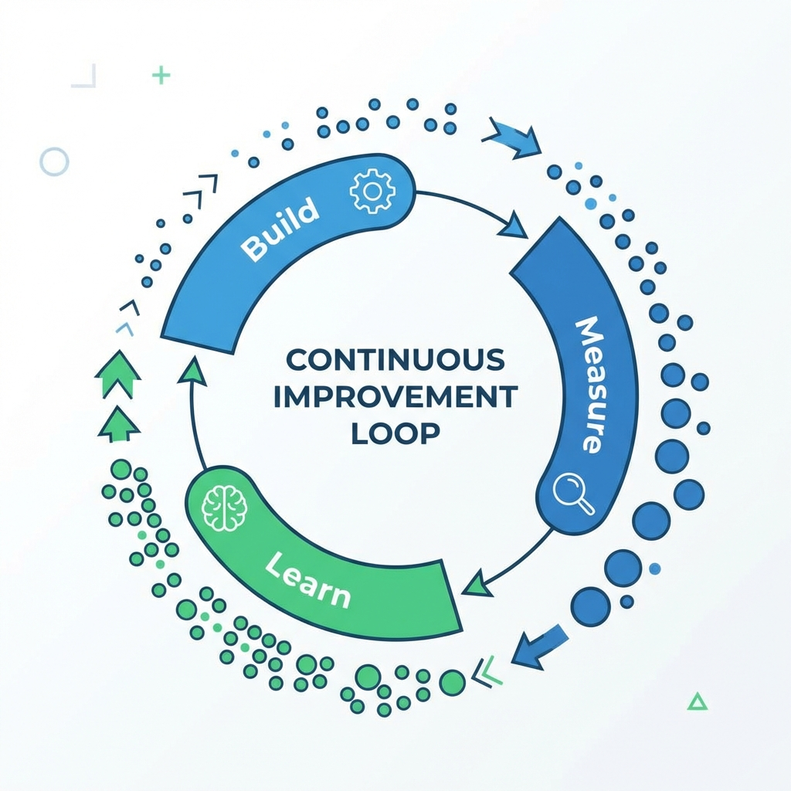

<p align="center">
  
</p>

## Introduction — The Engineering Paradox

Engineers love clean systems.

We obsess over:
- Proper abstractions  
- Scalable architecture  
- Edge-case coverage  
- "Doing it right the first time"  

This instinct isn't wrong. It's **essential** for systems that already need to exist.

But here's the uncomfortable truth:

> **Most products don't fail because the code is bad.**  
> **They fail because they solved the wrong problem extremely well.**

That's why **Minimum Viable Product (MVP)** beats almost everything else — especially for engineers who default to building perfectly for problems that may not even matter.

---

## MVP Is Not "Bad Code"  
### It's Intentional Incompleteness

Let's clear up the most persistent misconception.

MVP does **not** mean:
- ❌ Spaghetti code everywhere  
- ❌ No tests at all  
- ❌ Zero thought about the future  
- ❌ Technical debt by design  

MVP means:

> **Build the minimum system that answers one risky question about reality.**

Engineers usually optimize for:
> *"Can this scale to a million users?"*

MVP asks:
> *"Should this exist at all?"*  
> *"Will anyone actually use this?"*  
> *"Does this solve a real problem?"*

These are fundamentally different questions. The first assumes demand. The second tests it.

<p align="center">
  
</p>

---

## MVP Is a Feedback System, Not a Feature Set

Think of MVP like observability in production systems.

You don't add logs, metrics, and traces because it's fun.  
You add them because **you're flying blind without feedback**.

MVP does the same thing — but for **product truth** instead of system health.

### Without MVP:
- 💭 You debate opinions endlessly  
- 🏗️ You over-architect for hypothetical scale  
- ❓ You argue about edge cases that may never happen  
- 📊 You make decisions based on gut feelings  

### With MVP:
- ✅ Users vote with actual behavior  
- 🔪 Data kills bad ideas early (and cheaply)  
- 🎯 Direction becomes obvious instead of debatable  
- ⚡ Iteration speed compounds  

<p align="center">
  
</p>

**The meta-insight:** MVP is less about shipping fast and more about **learning fast**. Speed is just a side effect of keeping scope ruthlessly small.

---

## Real Company Examples Engineers Respect

Theory is nice. Let's look at how real companies — ones you've heard of and probably use — leveraged MVPs to validate demand before investing in "proper" engineering.

---

### 🏠 Airbnb — MVP as Manual Operations

<p align="center">
  
</p>

Airbnb didn't start with:
- Fraud detection systems  
- Scalable infrastructure  
- Dynamic pricing algorithms  
- Review moderation pipelines  

Their **actual MVP** was:
- A simple website (basically a CRUD app)  
- Founders **personally** onboarding hosts  
- Founders **personally** taking photos of apartments  
- Manual payment coordination  

**Engineering takeaway:**  
They delayed solving scaling problems until **demand was proven**. Building a fraud detection system for zero users is waste. Building it for 10,000 hosts is smart investment.

**The pattern:** Start with embarrassingly manual processes. Automate what hurts.

---

### 📦 Dropbox — MVP as a Demo, Not a Product

<p align="center">
  
</p>

Dropbox's first MVP wasn't even a working system.

It was:
- ✅ A 3-minute demo video  
- ✅ Showing file sync *as if it already worked*  
- ✅ Posted on Hacker News  

**Result:**  
Beta signups exploded from 5,000 to 75,000 overnight.

**Engineering takeaway:**  
Sometimes the best MVP **avoids engineering entirely** — until the riskiest assumption is validated. The risky assumption wasn't "Can we build file sync?" (They knew they could). It was "Will developers actually want this?"

**The principle:** Test demand before building supply.

---

### 💳 Stripe — MVP as One Killer Developer Workflow

<p align="center">
  
</p>

Stripe didn't win because payments were new.  
They won because they shipped **one magical experience**:

```bash
# Before Stripe (PayPal, Authorize.net)
# - Multiple pages of forms
# - Weeks of integration time
# - Terrible documentation
# - Manual merchant account setup

# With Stripe (MVP version)
curl https://api.stripe.com/v1/charges \
  -u sk_test_YOUR_KEY: \
  -d amount=2000 \
  -d currency=usd \
  -d source=tok_visa \
  -d description="Test charge"

# Result: { "id": "ch_1234", "status": "succeeded" }
```

**That's it.** Seven lines of code. Payments in 5 minutes.

**What they DIDN'T build initially:**
- ❌ Full billing platform (added later)  
- ❌ Subscriptions (added later)  
- ❌ Connect marketplace (added later)  
- ❌ Global compliance (expanded over years)  

**Engineering takeaway:**  
They picked **one developer pain point** (complex payment integration) and made it absurdly simple. Then they expanded from that beachhead.

**The insight:** An MVP doesn't need to do everything. It needs to do **one thing so much better** that people can't go back.

---

## The Spectrum: MVP vs Over-Engineering

<p align="center">
  
</p>

Let's be honest about where engineers tend to fall on this spectrum:

### 🎯 **Healthy MVP** (Sweet Spot)
**Characteristics:**
- Automated tests for core flows  
- Basic error handling  
- Simple deployment process  
- Logs for debugging  
- No premature optimization  

**Philosophy:** "This will break in predictable ways if we're wrong. That's fine."

---

### 🏗️ **Over-Engineered** (Engineering Trap)
**Characteristics:**
- Microservices for a product with no users  
- Complex CI/CD pipeline before first customer  
- Kafka/Redis because "we might need it"  
- Three-tier caching strategy  
- Database sharding for 100 rows of data  

**Philosophy:** "We're building this to scale to millions!" (Narrator: It never got there.)

**Why it fails:**  
Not because the engineering is bad. It fails because **all that effort was spent on the wrong problem**. You built a Ferrari for a road that doesn't exist.

---

### ⚠️ **Reckless Prototyping** (Dangerous)
**Characteristics:**
- No version control  
- Zero error handling  
- Hard-coded credentials in code  
- "Works on my machine" as deployment strategy  
- No way to rollback  

**Philosophy:** "Move fast and break things!"

**Why it fails:**  
Yes, you learned fast. But now you have a house fire disguised as a product. And your early adopters — the people who trusted you — are the ones who got burned.

---

## The Iteration Advantage

<p align="center">
  
</p>

Here's the compound effect that most engineers miss:

```
Perfect First Time: 
  6 months → Launch → Learn you built the wrong thing → ❌

MVP Iteration:
  2 weeks → Launch → Learn → Pivot → 2 weeks → Launch → Learn → Adjust → 2 weeks → ...
```

After 6 months:
- **Perfect approach:** 1 data point, potentially wrong  
- **MVP approach:** 12+ iterations, converging on truth  

**The math is brutal:** Iteration speed compounds faster than perfection.

And here's the kicker: The team that shipped 12 times learned **12x more** about their users, their domain, and their own code than the team that shipped once.

---

## When NOT to MVP

MVP isn't a universal law. There are contexts where it's the wrong strategy:

### 🚫 **Life-Critical Systems**
Medical devices, aviation software, autonomous vehicles.  
**Why:** The cost of being wrong is literal death. You don't MVP your way into FDA approval.

---

### 🚫 **Regulated Industries (Sometimes)**
Banking, insurance, legal compliance platforms.  
**Why:** Regulatory overhead often makes the "minimum" still enormous. Though even here, companies like Robinhood found ways to test narrow use cases first.

---

### 🚫 **Deep Infrastructure**
Databases, operating systems, compilers.  
**Why:** No one adopts a "potentially broken" Postgres. Infrastructure needs reliability from day one.

---

### 🚫 **When You Already Know**
If you've built this exact thing three times before in different companies, you don't need to validate the problem again. Just build the damn thing.

---

## How to Actually Build an MVP (The Engineer's Checklist)

Here's a practical framework:

### 1. **Identify the Risky Assumption**
Not all assumptions are equal. Focus on the **riskiest one**:
- ❓ "Will users pay for this?"  
- ❓ "Can we acquire users cheaply enough?"  
- ❓ "Is the technical approach feasible?"  

Pick **one**. Test it first.

---

### 2. **Define "Minimum"**
Ask: *"What's the smallest thing I can build to test this assumption?"*

Not: "What features would be cool?"  
Not: "What would the final product look like?"

**Just:** What's the cheapest experiment that gives signal?

---

### 3. **Set a Time Limit**
MVPs without deadlines become "perfect products with incomplete features."

Rule of thumb:
- **1-2 weeks** for pure validation  
- **4-8 weeks** for something with a few users  
- **12 weeks** absolute max before you're over-building  

---

### 4. **Ship to Real Users**
Friends and family don't count. They'll lie to you (lovingly).

Real users:
- ✅ Don't know you personally  
- ✅ Have the actual problem  
- ✅ Will tell you the truth (often brutally)  

---

### 5. **Measure the Right Thing**
Not vanity metrics. Real behavior:
- Do they come back?  
- Do they pay?  
- Do they refer others?  
- Which features do they actually use?  

---

### 6. **Kill or Iterate**
Be honest with the data:
- ✅ **Strong signal?** → Double down  
- ⚠️ **Weak signal?** → Iterate and retest  
- ❌ **No signal?** → Kill it and try something else  

The point of an MVP is to **fail cheap**. Don't waste six more months trying to save two weeks of work.

---

## The Question Every Founder (and Engineer) Must Answer

At the end of the day, MVP discipline comes down to one question:

> **"What's the cheapest way to find out if I'm wrong?"**

If your answer involves six months and a distributed system, you're not building an MVP.  
You're building a **conviction** disguised as a product.

And conviction, without validation, is just an expensive way to be wrong.

---

## Final Thought — Speed Is a Feature, Learning Is the Product

MVP culture isn't about cutting corners.  
It's about **cutting the right corners** to maximize learning velocity.

Perfect code for the wrong product is waste.  
Imperfect code for the right product is progress.

As engineers, our job isn't to build perfect systems.  
**It's to build systems that should exist.**

And the only way to know what should exist is to **ask reality** — not our assumptions, not our architectural preferences, not our engineering pride.

Build small. Ship fast. Learn brutally. Iterate relentlessly.

**That's the MVP way.**

---

**Want to go deeper?**  
Check out:
- [The Lean Startup by Eric Ries](https://theleanstartup.com/)  
- [Inspired by Marty Cagan](https://www.svpg.com/inspired-how-to-create-products-customers-love/)  
- [Shape Up by Basecamp](https://basecamp.com/shapeup)  

And remember: The best engineers aren't the ones who write the most code.  
**They're the ones who know which code not to write.**
