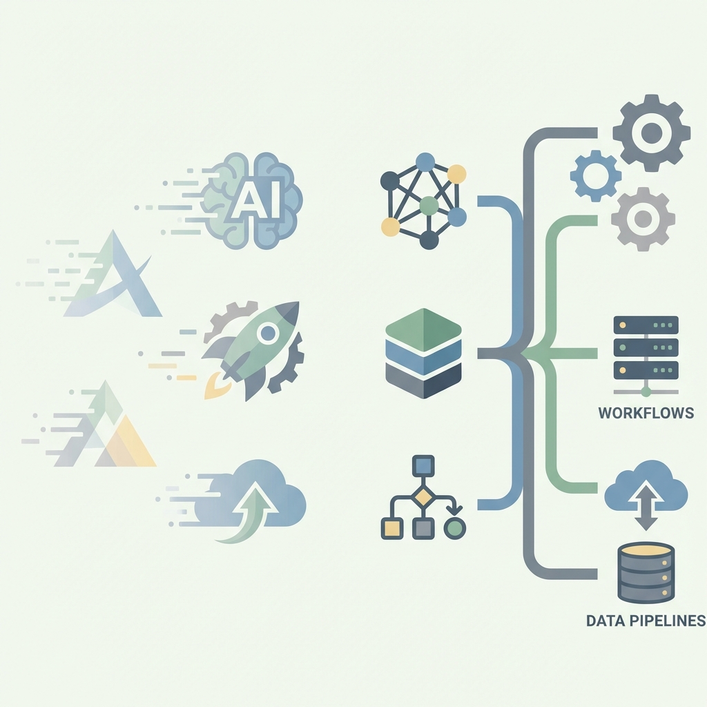
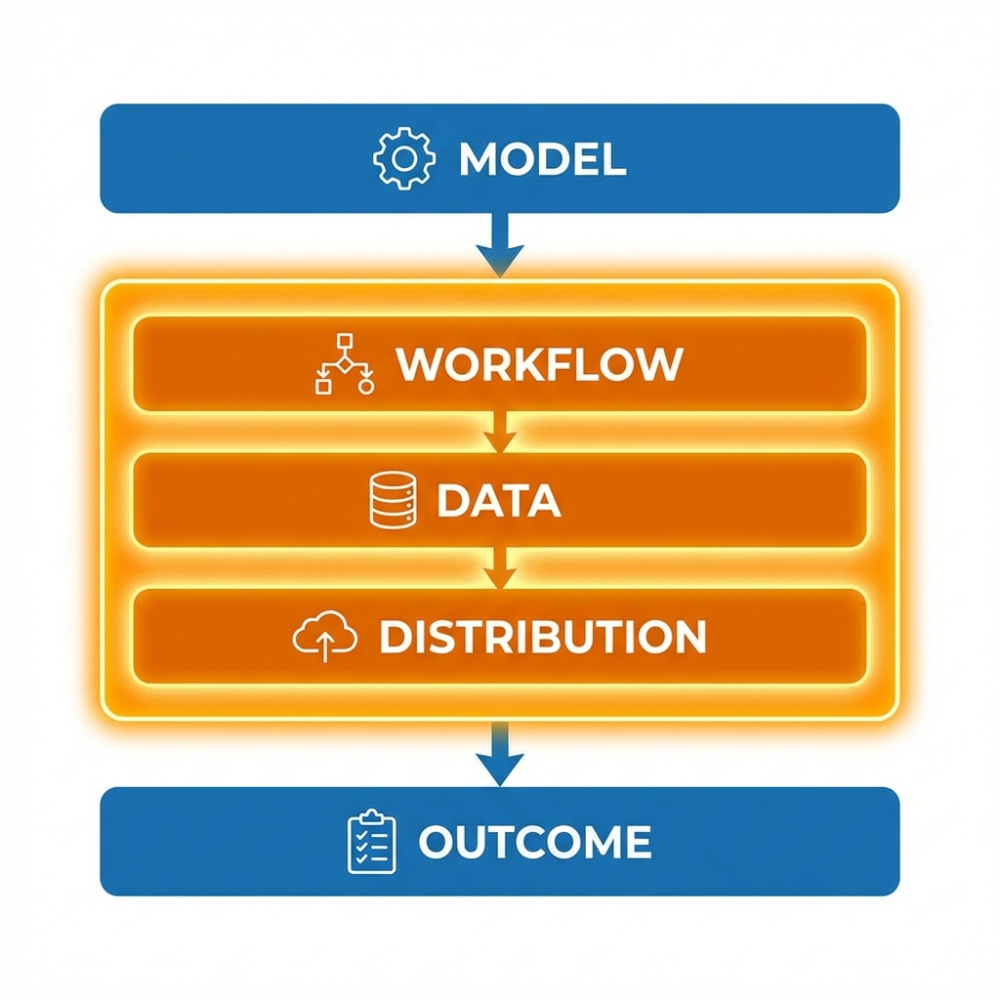

  

## Everyone Is Building AI. Most Won’t Last.

In the last two years, AI startups exploded.

New tools every week.  
Demos that look magical.  
Founders shipping faster than ever.

And yet — most of these startups are quietly **replaceable**.

Not because they use APIs.  
Not because they don’t train their own models.  
But because they misunderstand **where value actually lives**.

The term “AI wrapper” gets thrown around as an insult.  
But it’s the wrong diagnosis.

---

## The Real Pattern Behind Failed AI Startups

Most failed AI startups share three traits:

1. **Their core value is a model capability**
2. **Users can switch tools instantly**
3. **Nothing breaks when the product disappears**

If your product’s pitch is essentially:

> “Look what GPT can do now”

You’re on a clock you don’t control.

Models improve.  
Platforms copy.  
Your differentiation evaporates.

---

## Failure Stories: When “Wrapper” Meant Replaceable

### AI PDF Chat Tools

The idea was compelling: *chat with your documents*.

But the reality was harsh:
- No deep workflow ownership
- No proprietary data advantage
- No lock-in beyond convenience

Once ChatGPT, Microsoft Copilot, and Adobe shipped native document chat, these products lost their reason to exist.

**Lesson:**  
If a platform can ship your core feature as a checkbox, you never owned the problem.

---

### AI Copywriting Startups

The 2023–2024 wave was massive:
- Blog generators
- SEO writers
- Ad copy tools

They grew fast — and churned faster.

Why?
- Output didn’t equal outcome
- Users didn’t need text, they needed traffic and revenue
- Content became a baseline feature everywhere

**Lesson:**  
If users don’t lose money or time without you, you’re optional.

---

### AI Resume Builders

Most were one-time-use tools:
- Generate resume
- Download PDF
- Never return

They didn’t own:
- Hiring pipelines
- Recruiter feedback
- Interview outcomes

**Lesson:**  
One-time value is not a business.

---

## The Quiet Winners Don’t Look Impressive at First

Now let’s look at startups that *do* survive — and why they’re often misunderstood.

---

### Harvey AI (Legal)

From the outside, it looks like:
> “GPT for lawyers”

In reality:
- Embedded in law firm workflows
- Trained on firm-specific context
- Handles compliance, research, and due diligence

Once adopted, switching is painful.

**Why it survives:**  
It owns workflow, trust, and historical context — not just generation.

---

### Cursor (AI Code Editor)

At first glance:
> “Just GPT inside an editor”

But Cursor:
- Lives inside daily developer work
- Understands entire codebases
- Learns from edits, refactors, and mistakes

If Cursor disappeared tomorrow, developers wouldn’t miss autocomplete — they’d miss **thinking leverage**.

**Why it survives:**  
Habit + irreversibility.

---

### Glean (Enterprise Search)

Surface-level view:
> “AI search for company docs”

Reality:
- Cross-tool organizational memory
- Permissions, context, and history
- Becomes the company’s knowledge backbone

**Why it survives:**  
Search isn’t the product.  
**Organizational memory is.**

---

## Where AI Value Actually Compounds

   Workflow -> Data -> Distribution -> Outcome Layers" width="80%" />

Every AI product sits on layers:

- **Model** – commoditized fast
- **Workflow** – where pain lives
- **Data** – where moats begin
- **Distribution** – trust and habit
- **Outcome** – money saved, risk reduced, time reclaimed

Most replaceable startups stop at **model + UI**.

Real products dominate **at least two layers above that**.

---

## What a “Real AI Product” Means in 2026

A real AI product is **not** defined by:
- Fine-tuning
- Custom models
- Prompt engineering

It *is* defined by **irreversibility**.

If users leave and nothing breaks — you built a tool.  
If leaving hurts — you built a system.

---

## The Brutal Test Every Founder Should Apply

Ask one question:

> If GPT-6 launches tomorrow, what breaks?

- ❌ “Our main feature” → replaceable  
- ✅ “Our margins get better” → durable  

That’s the pattern.

---

## Final Thought

AI is not the product.  
AI is **leverage**.

The real product is:
- The workflow you replace
- The decision you automate
- The outcome you guarantee

Everything else is just a demo.

  

