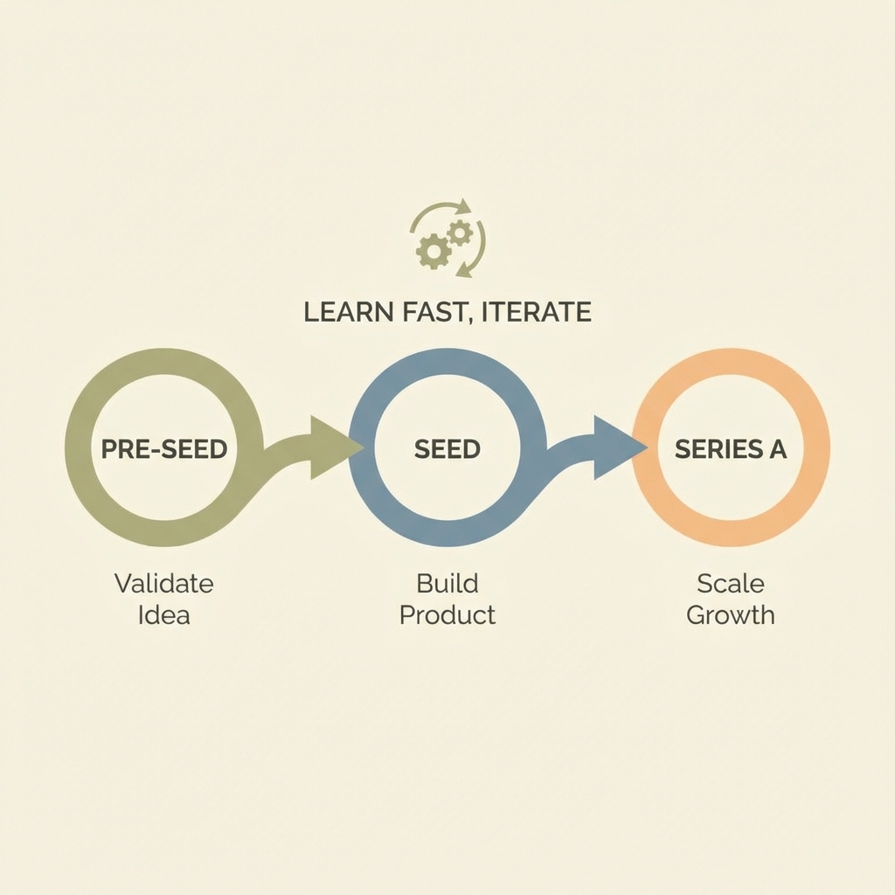
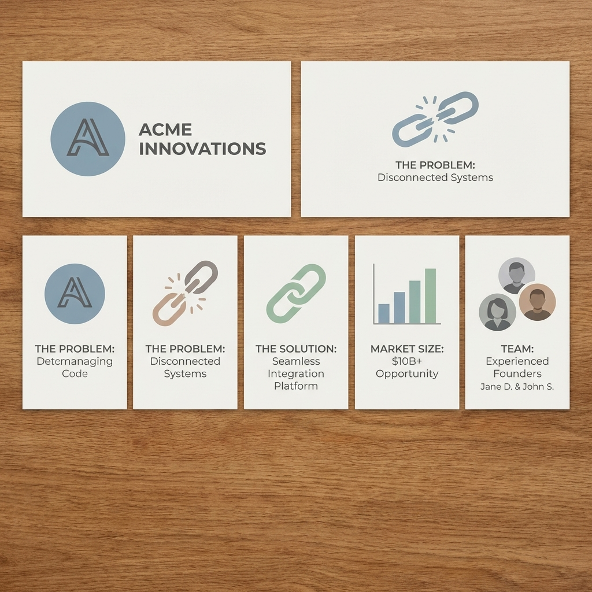

  

## Introduction — Seed funding is misunderstood

Most first-time founders believe seed funding is for building the full product, hiring a large team, or moving fast before competitors. That belief quietly kills startups.

**Seed funding is not money to build. It’s money to prove.**

> Prove that this team can turn uncertainty into clarity.

Nothing more. Nothing less.

---

## The real job of a seed round

A seed round exists to answer **one brutal question**: “Should this startup exist at Series A scale?”

Investors at this stage aren't necessarily looking for profitability, polish, or an impressive office. They are looking for:

- **Problem validation:** Is the problem real?
- **Solution relevance:** Is the solution non-random and effective?
- **Learning velocity:** Is the team learning faster than the market?

Seed is a **test of judgment**, not execution perfection.

---

## Why investors fund chaos at seed

At the seed stage, metrics are noisy, roadmaps are often wrong, and products are inevitably half-broken. Investors know this.

What they look for instead is:

- **Speed of iteration:** How quickly can you move from feedback to fix?
- **Quality of decisions:** Why did you choose this path over others?
- **Founder honesty:** Are you being real with yourself about the data?

Two startups can have the same idea. The one that **learns faster** wins the seed.

  

---

## There are three different seed rounds

Founders often get rejected because they pitch the **wrong story to the wrong round**. It's critical to treat them differently.

### 1. Pre-seed — belief capital
This stage is about an idea or a very early MVP. You are selling a **strong founder narrative** and early signals rather than hard data. At pre-seed, you're essentially saying: *"Trust my thinking."*

---

### 2. Institutional seed — signal capital
By this point, you should have real users, a clear use case, and early signs of retention or revenue. You’re selling the fact that *"This is working in a small but meaningful way."*

---

### 3. Seed extension — momentum capital
If you're growing faster than expected and want to reduce future risk, you raise an extension. You’re telling investors to *"Double down now"* because the conviction is increasing.

Calling all three "seed" is how founders confuse themselves and their potential investors.

---

## Traction at seed is not a dashboard

Traction is **behavior**, not just numbers on a screen. Real seed-stage traction looks like:

- Users returning without constant reminders.
- Someone getting angry when your product breaks.
- Manual usage before you've even built the automation.
- Absolute clarity on who this is *not* for.

**Examples of real traction:**
- **B2B SaaS:** 3–5 teams using the product weekly.
- **Dev Tool:** Active GitHub issues (engagement) rather than just stars (vanity).
- **Consumer:** Strong retention after day 7 or day 30.

> Revenue is a signal. **Pull is the proof.**

  

---

## Valuation is a tool — not a trophy

Seed valuation is not a mathematical certainty. It’s a combination of **momentum, story, and timing**.

The common mistakes founders make include:
- Optimizing solely for the highest valuation.
- Ignoring the quality of the investors.
- Taking money before achieving any clarity.

**Healthy seed rounds usually involve:**
- 10–20% dilution.
- 12–18 months of runway.
- Investors who stay calm during the inevitable noise of early stages.

**Red flags at seed:**
- 30%+ dilution.
- Control rights being requested too early.
- An obsession with optics over actual learning.

> Bad seed investors don’t just hurt this round — they poison the next one.

---

## Your seed deck only needs five answers

Seed decks don’t fail because they’re ugly. They fail because they’re **confused**. Your deck must clearly answer:

1. **What painful problem exists?**
2. **Why is this solution inevitable?**
3. **Why is this team right?**
4. **What early signal proves this?**
5. **How big could this realistically get?**

Avoid feature tours, fantasy TAM slides, and technical flexing. Seed decks sell **clarity of thought**.

  

---

## The part nobody warns founders about: psychology

Seed funding changes your behavior. Suddenly, there is a risk of building for optics, fearing a slowdown, or confusing activity with progress.

Remember this: **Seed money is borrowed conviction.**

It doesn’t reduce responsibility; it increases it. The best founders use seed funding to:
- Kill bad ideas faster.
- Focus harder on one essential truth.
- Say "no" more often than "yes".

---

## Conclusion

Seed funding is not validation. It’s **permission**. It is permission to learn faster, to be wrong publicly, and to earn belief through progress.

Raise seed when you have signal instead of noise, when you know exactly what you need to prove next, and when you are ready for the accountability that comes with it. Not just because everyone else is doing it.

  

