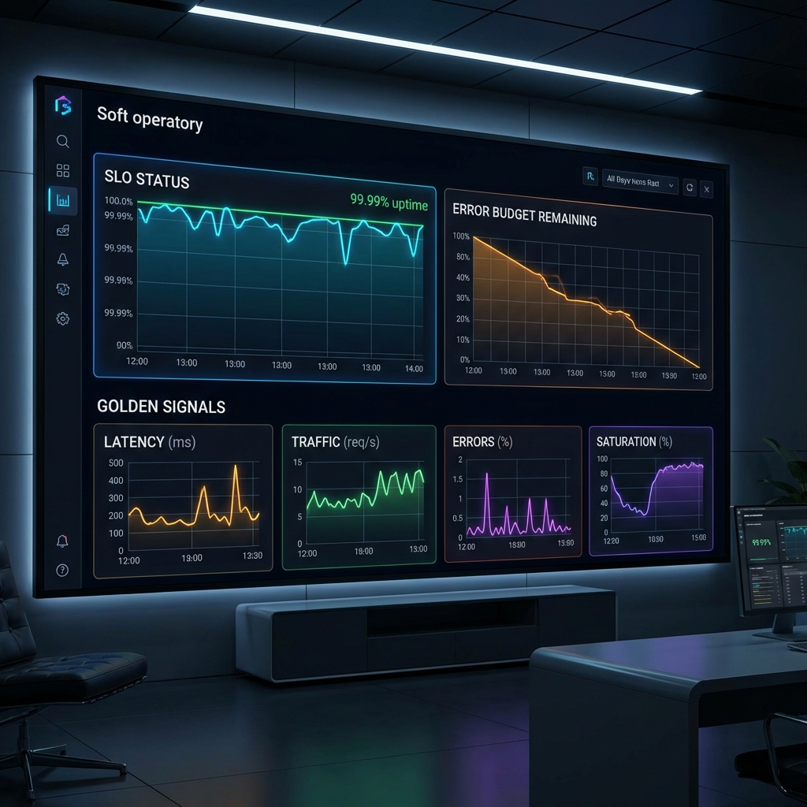

  

## Introduction — The Uptime Myth

"We had 99.99% uptime last month!" sounds like a victory. But if your users were experiencing 5-second latencies or broken checkout buttons, that number is a lie. In modern SRE (Site Reliability Engineering), uptime is a vanity metric.

At the Staff level, we care about **Reliability from the user's perspective.**

---

## The SLO Paradox: Reliability is a Feature

Every 9 you add to your uptime goal makes development slower and more expensive. 100% reliability is almost always the wrong target.

**The SLO (Service Level Objective)** is the bridge between business needs and engineering reality. It defines the point where the user starts getting frustrated. 

- **SLI (Indicator):** What we measure (e.g., Latency).
- **SLO (Objective):** The target (e.g., 95% of requests < 200ms).
- **Error Budget:** The remaining "allowed" failure.

> "If you have an error budget left at the end of the quarter, you're not moving fast enough."

---

## Moving Beyond the "Golden Signals"

While Latency, Traffic, Errors, and Saturation are important, they don't tell the whole story. To truly measure impact, consider:

1. **MTTD (Mean Time to Detect):** Automated monitoring should be the first to know, not a customer on Twitter.
2. **Cost per Reliable Request:** How much are we over-provisioning to stay "safe"?
3. **Change Failure Rate:** How many of our deployments lead to an immediate rollback?

---

## Conclusion

Systems exist to serve users, not to stay alive. The best SREs aren't the ones who keep the lights on no matter what; they are the ones who use data to decide when it's safe to take risks and when it's time to pause and focus on stability.
