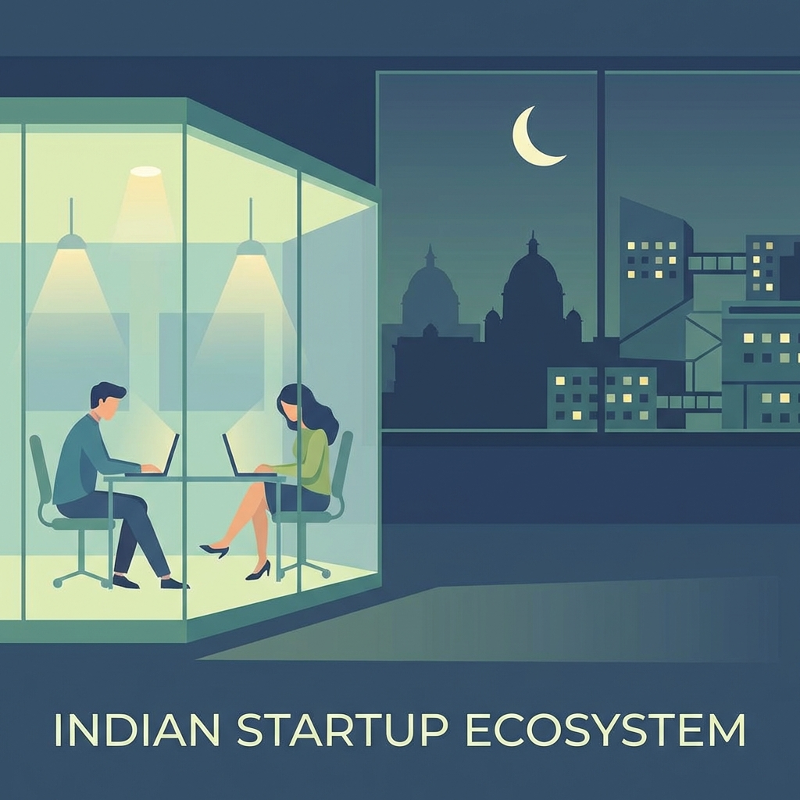
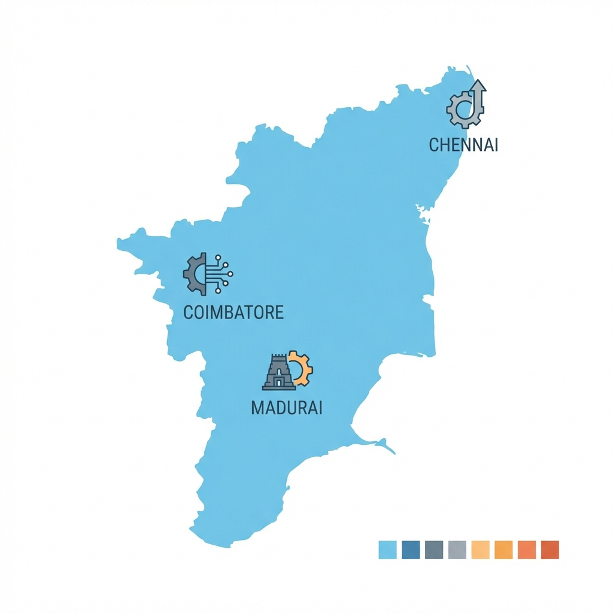

  

# 🚀 The Incubation Engine  
### Strategic Capital, Structural Alpha, and the High-Stakes Founder's Playbook

In the noise of the venture-led "growth at all costs" era, the fundamental purpose of incubation has been obscured by brochure-ware and surface-level networking. For the high-stakes founder—those building deep-tech, complex SaaS, or regulated hardware—incubation is not about "perks"; it is a **strategic maneuver to manufacture structural alpha**.

This guide moves beyond the basics. We are deconstructing:
- The **Physics of Incubation**: Buying time and building credibility.
- **Grant Engineering**: Navigating India's non-dilutive capital stack.
- **The Regional Powerhouse Strategy**: Why the Tamil Nadu ecosystem provides a unique competitive edge.
- **The Pilot Paradox**: Using institutional leverage to crack closed industries.

---

## 1️⃣ The Incubation Hypothesis: Buying Time & Credibility

For a working professional transitioning into a founder, the "cliff" is usually financial or reputational. An incubator acts as a **vulnerability buffer**.

> **Structural Alpha:** The ability to operate with the credibility of a large institution (IIT, NITI Aayog, StartupTN) while maintaining the agility of a two-person team.

An incubator is a tool for **Institutional Borrowing**:
- **Reputational Arbitrage:** Using the incubator’s brand to hire talent or secure enterprise meetings you couldn't get as an individual.
- **Operational Subsidy:** Converting high fixed costs (labs, server credits, office space) into zero-cost infrastructure.
- **Decision Clarity:** Replacing "fear-of-failure" with "deadline-driven accountability."

---

## 2️⃣ Velocity vs. Endurance: Decoupling Strategic Fit

The industry often confuses Incubators and Accelerators. For a sophisticated founder, the choice is between **Time vs. Equity**.

| Strategic Pillar | Incubator (Strategic Infrastructure) | Accelerator (Velocity Multiplier) |
|:---:|:---|:---|
| **Objective** | Building the *Right* Product | Scaling the *Known* Product |
| **Philosophy** | Patience as a Feature | Velocity as a Proxy for Success |
| **Capital Type** | Non-Dilutive (Grants/Credits) | Dilutive (Seed/Pre-seed Checks) |
| **IP Ownership** | Protected | Often subject to pressure |
| **Professional Fit** | **High** (Concurrent with career) | **Low** (Requires full-time pivot) |

---

## 3️⃣ Grant Engineering: Navigating India's Capital Stack

India’s government-backed ecosystem (Startup India) is a powerhouse of **Non-Dilutive Capital**. The trick is not just "applying," but "stacking."

### 🇮🇳 The National Blueprint (Backbone)
1.  **NIDHI-PRAYAS/EIR:** Targeted at the "valley of death"—moving from idea to prototype without giving up 7% of your cap table.
2.  **MeitY TIDE 2.0:** Specifically for AI, IoT, and high-tech SaaS. It provides the financial runway to focus on R&D over revenue.
3.  **Startup India Seed Fund Scheme (SISFS):** A bridge between early prototype and market entry, often distributed through verified incubators.

---

## 4️⃣ Regional Powerhouses: The Tamil Nadu Advantage

While Bangalore has the volume, Tamil Nadu has the **institutional depth and pilot-readiness**. For founders targeting manufacturing, SaaS, or deep-tech, the TN ecosystem offers a distinct "unfair advantage."

### 🏛️ StartupTN: The Modern Nodal Paradigm
Unlike traditional bureaucracies, StartupTN functions as a **Venture Enabler**.
- **TANSEED Grants:** Direct equity-free funding for early-stage innovation.
- **Industry Connects:** Direct lines into the state's massive manufacturing and automotive sectors.

### 🔥 Key Strategic Hubs
- **IIT Madras Incubation Cell (IITMIC):** The gold standard. Their selection is a global signal of technical viability. Ideal for deep-tech, hardware, and core engineering.
- **iTNT Hub (Chennai):** Focused on the intersection of deep-tech and public sector impact.
- **Forge (Coimbatore):** The powerhouse for industrial IoT and hardware. They don’t just mentor; they help you build industrial-grade prototypes.

> **Insight:** Don't ignore Tier-2 cities (Madurai, Trichy). The "Incubator-to-Grant" conversion rate is often higher due to lower noise-to-signal ratios.

  

---

## 5️⃣ The Pilot Paradox: Cracking Closed Doors

The hardest part of B2B or Government-focused startups is the **Gatekeeper**.
Incubators solve this via **Strategic Pilots**:
1.  **Sandboxing:** Testing your tech in a controlled, risk-free environment backed by the incubator.
2.  **Reference Sales:** Using your incubator as your "First Customer" or "First Prover" to validate the solution for global markets.
3.  **Procurement Ease:** Many government-backed incubators (especially in TN) have pathways to simplify procurement for recognized startups.

---

## 6️⃣ The High-Stakes Founder's Checklist

Before you apply, audit your readiness. If you aren't optimizing for these, you are wasting the slot.

- [ ] **Infrastructure Deficit:** Do I need labs, AWS credits, or co-working space that costs >$500/mo?
- [ ] **Credential Gap:** Do I need an "IIT" or "Startup India" badge to close my first enterprise pilot?
- [ ] **Runway Resilience:** Am I looking for ₹5L–₹25L in grants to avoid taking a shitty VC deal?
- [ ] **Intellectual Perimeter:** Is my IP strategy solid enough to survive the institutional gaze?

---

## 7️⃣ Final Advice: Leverage, Not Validation

The most common failure mode is **"Incubator Tourist" syndrome**. Founders who collect incubator badges but never build a product.

**The Master Move:** Use an incubator to eliminate risks so that when you finally approach a Tier-1 VC, you are talking about **Price**, not **Permission**.

---

### ✍️ Closing Thought

In the Indian ecosystem, an incubator is not a school—it's **Strategic Infrastructure**. If you are building from Tamil Nadu or anywhere in the national grid, use it to manufacture the alpha that your competitors are trying to buy with expensive venture capital.

Build intentionally.
