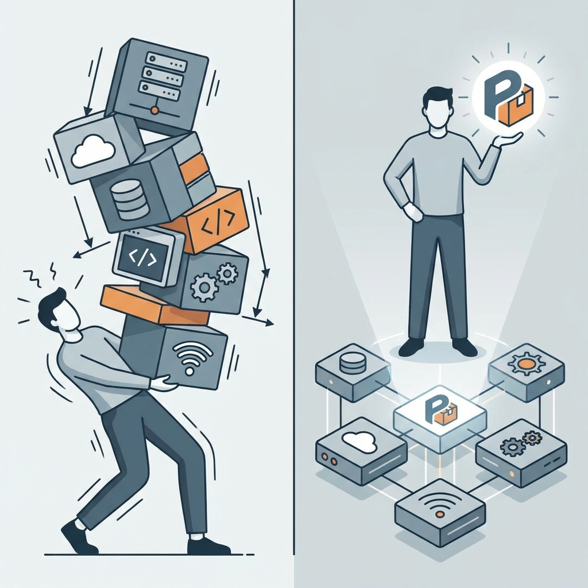
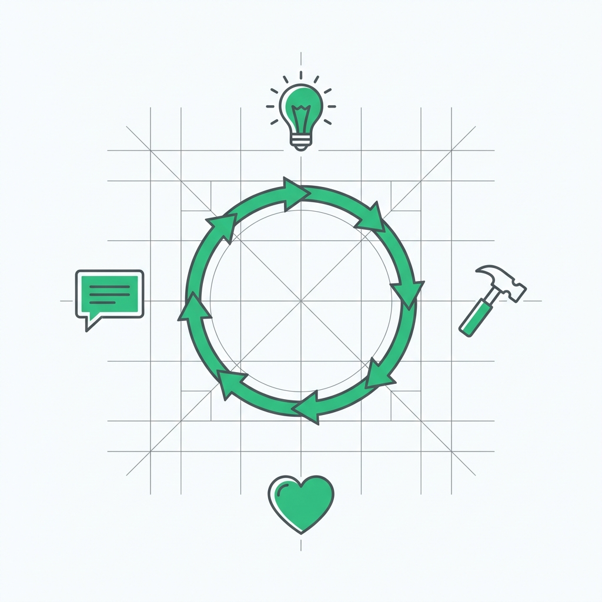

  

## Introduction — Beyond the Stack

For the last decade, the holy grail of startup hiring was the "Full-Stack Developer." 

The pitch was simple: someone who could write the CSS, design the API, and manage the database. They were the Swiss Army knives of the tech world.

But in the modern startup ecosystem, **the stack is no longer the bottleneck.**

With the advent of managed infrastructure (Vercel, Supabase), robust component libraries (Radix, Tailwind), and AI-augmented coding (Cursor, GitHub Copilot), the technical barrier to "building the thing" has collapsed.

Today, the most valuable engineers aren't the ones who can navigate every layer of the stack. They are the ones who can bridge the gap between **code and customer value**.

Welcome to the era of the **Product Engineer.**

---

## The Full-Stack Fallacy

The term "Full-Stack" was always a bit of a misnomer. In reality, it often meant "someone who is mediocre at everything."

The focus was on **layers**:
- Can you write SQL?
- Can you write Express?
- Can you write React?

This layer-based thinking is a relic of the industrial era of software. It assumes that if we just assemble the right technical components, a product will emerge.

But startups don't fail because they couldn't find someone to write SQL. They fail because they built a technically sound system that **nobody wanted to use.**

  

> **The Full-Stack Developer asks:** "How do I build this feature?"  
> **The Product Engineer asks:** "Why are we building this, and is there a simpler way to solve the user's problem?"

---

## What is a Product Engineer?

A Product Engineer is an engineer who thinks in **outcomes**, not just inputs.

They aren't just consumers of a PRD (Product Requirement Document). They are active participants in the discovery process. They understand that code is just a means to an end.

### Core Traits of a Product Engineer:

1. **User Empathy**: They actually use the product. They feel the friction points. They don't need a designer to tell them a button is misplaced.
2. **Business Context**: They understand the "why." They know how a feature impacts retention, conversion, or churn.
3. **Pragmatic Laziness**: They look for the shortest path to value. If a third-party tool can replace 1,000 lines of custom code, they choose the tool every time.
4. **Communication**: They can talk to a customer, a designer, and a CEO with the same clarity they use for a compiler.

---

## The Product Engineer's Toolkit

In the past, an engineer's toolkit was a list of languages: Java, Python, JavaScript.

The Product Engineer's toolkit is much broader. It includes:

- **Observability as Insight**: Using tools like PostHog or Sentry not just for bugs, but to see where users get stuck.
- **Prototyping over Perfection**: Building "hacky" versions of features to get signal before investing in a robust architecture.
- **Design Systems**: Leveraging existing UI frameworks to spend 90% of their time on logic and 10% on pixels.
- **AI Orchestration**: Using AI to handle the boilerplate, allowing them to focus on the high-level system design.

  

---

## Why Startups are Shifting

The shift from Full-Stack to Product Engineering is driven by **velocity**.

In a world where software is a commodity, the only remaining competitive advantage is **learning speed**.

### 1. Integration over Implementation
Building a payment system from scratch is a waste of time. Integrating Stripe is a strategic move. Product engineers specialize in **orchestrating world-class services** to create a unique value proposition.

### 2. The Feedback Compounding Effect
When an engineer understands the product, the feedback loop between "Idea" and "Reality" shrinks. They can make micro-decisions in the IDE that saved weeks of design debt later.

### 3. Ownership vs. Tickets
A "Full-Stack" dev often feels like a ticket-taker. A "Product Engineer" feels like a co-founder. They take ownership of the **problem**, not just the task.

---

## Conclusion — The Future is Product-Centric

The abstraction of the "stack" will continue. Soon, the "Full-Stack" will just be a single prompt or a cloud configuration.

But the need for engineers who can **think like products** will only grow.

If you are an engineer today, don't just learn another framework. Learn how companies make money. Learn how users think. Learn how to say "no" to a feature that doesn't move the needle.

Stop being a developer of stacks. Start being a builder of products.

**The future belongs to the Product Engineer.**

---

**Actionable Next Steps for Engineers:**
- **Join a customer call:** Listen to their frustrations without thinking about the code.
- **Look at the metrics:** Do you know your product's North Star metric? If not, find out.
- **De-scope something:** Look at your current task and find the 20% that delivers 80% of the value. Ship that first.

---

© 2026 Ashok Murugan
