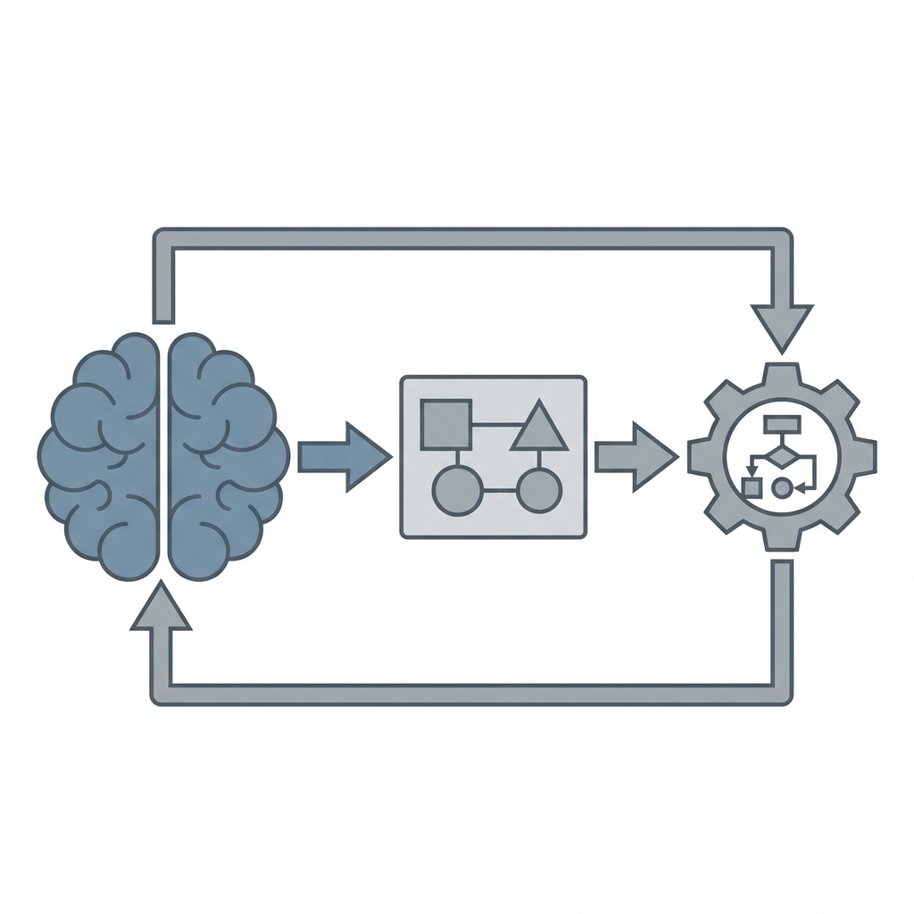
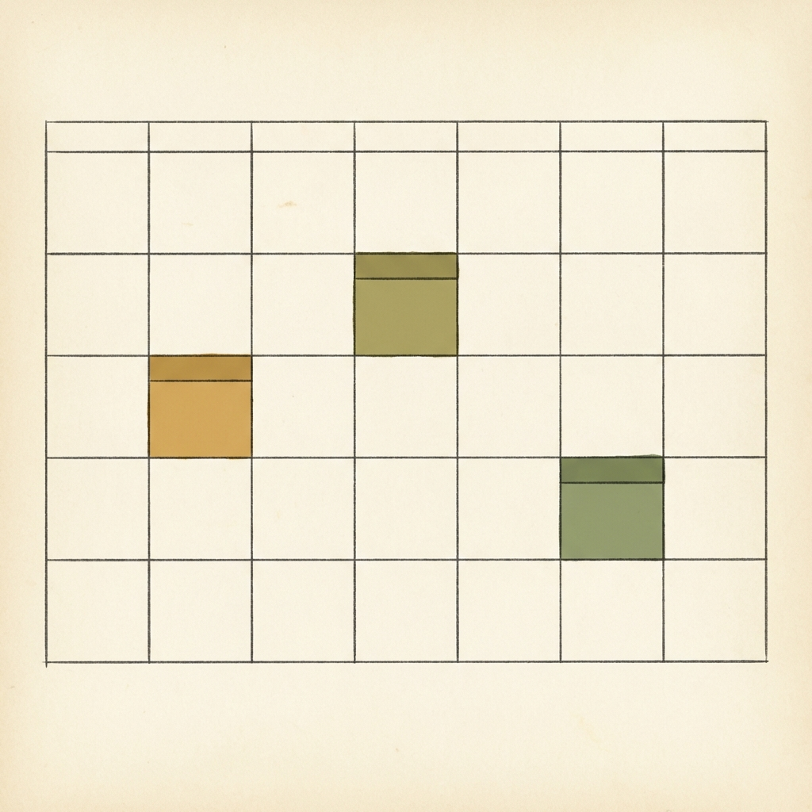
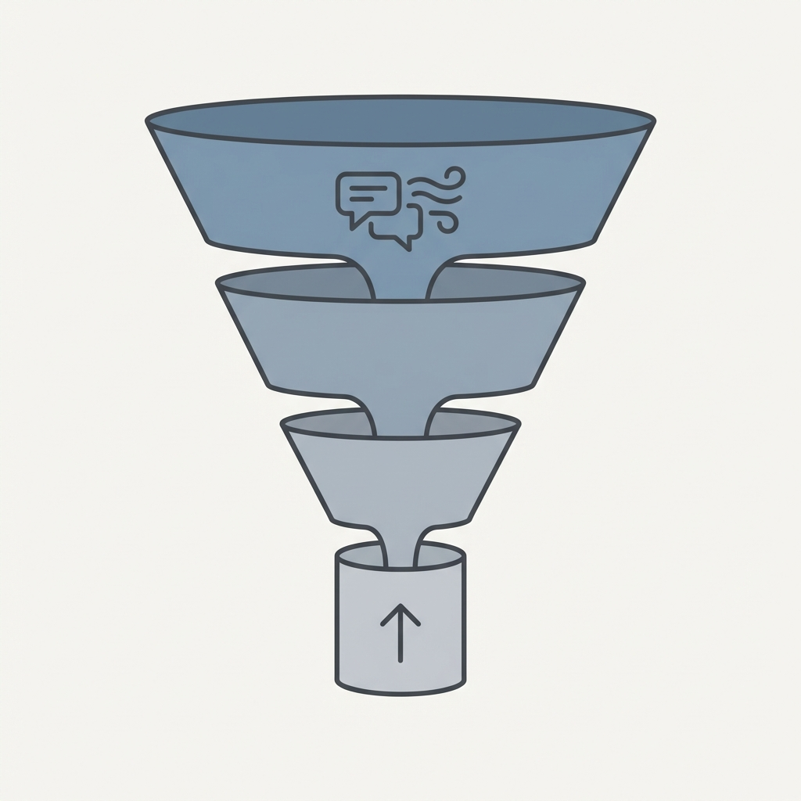

  

# The Solopreneur Operating System: How Working Professionals Build Startups Without Burning Out

---

## Introduction — Why Smart Side Projects Quietly Die

Most side projects don't fail dramatically.

They don't crash.  
They don't get rejected.

They just… stop.

The GitHub repo goes silent.  
The Notion doc stays unfinished.  
The domain renews once, then expires.

And the solopreneur tells themselves:

> "I'll restart when work slows down."

It rarely does.

This isn't a motivation problem.  
It's an **operating system problem**.

Most working professionals try to run a **full-time startup OS** on a **full-time job + real life**.

That mismatch is what quietly kills momentum.

This post is about designing a **Solopreneur Operating System (S-OS)** that actually fits reality.

---

## The Core Insight — You Don't Have a Time Problem

You don't lack time.  
You lack **usable energy and decision capacity**.

After a workday:
- Your brain is tired, not lazy  
- Decision-making slows down  
- Context switching becomes expensive  
- Motivation becomes unreliable  

So if your solopreneur plan depends on:
- Late-night heroics  
- Weekend marathons  
- "I'll push harder next week"  

…it's already fragile.

A good operating system doesn't rely on motivation.  
It **reduces the need for it**.

---

## What Is a Solopreneur Operating System

It's not a tool stack.  
It's not a productivity hack.

It's a **set of default rules** that decide:
- How you think  
- How you use time  
- What you work on  
- How you protect your mental state  

If you don't design these intentionally, they form randomly — and usually badly.

---

## The 4-Layer Solopreneur OS

---

## Cognitive OS — How a Solopreneur Thinks

Burnout starts **before execution**.

It starts when:
- Every idea feels promising  
- Every decision feels important  
- Every path feels irreversible  

This creates mental pressure even when you're "not working".

### Rules Over Decisions

Strong solopreneurs don't decide repeatedly — they set defaults.

Examples of healthy cognitive rules:
- "If I can't explain it in one sentence, it's not clear enough"
- "If it needs more than two weekends, it's too big"
- "No feature unless a real user explicitly asked for it"
- "Revenue clarity beats technical elegance"

These rules:
- Reduce overthinking  
- Kill scope creep early  
- Prevent emotional attachment to ideas  

> Burnout begins in the brain, not on the calendar.

  

---

## Time OS — How a Solopreneur Uses the Calendar

Most side projects fail due to **inconsistent time**, not lack of skill.

### The Common Trap

"I'll work whenever I get time."

What actually happens:
- Work keeps getting postponed  
- Guilt slowly builds  
- Startup work feels like extra burden  

### The Better System — Fixed, Boring Time

A sustainable solopreneur schedule looks like:
- 2–3 fixed slots per week  
- Same days, same time  
- Same type of work per slot  

Example:
- Tue (60 min): customer conversations  
- Thu (60 min): shipping improvements  
- Sat (90 min): thinking and direction  

Outside these slots → **zero guilt**.

This converts solopreneur work from:
> "Extra effort" → "Normal routine"

  

---

## Execution OS — What a Solopreneur Actually Works On

Here's a hard truth:

A solopreneur's job is **not building**.  
It's **reducing uncertainty**.

### Correct Execution Priority

1. Talk to users  
2. Validate willingness to pay  
3. Ship ugly but usable solutions  
4. Optimize only after signal  

If your execution starts with:
- Tech stack debates  
- Perfect UI  
- Scalability planning  

You're avoiding rejection, not building a business.

Ask this every week:
> "What uncertainty did I remove this week?"

If the answer is "I built a lot" but learned nothing — that's a warning sign.

  

---

## Emotional OS — Burnout Prevention for Solopreneurs

Most solopreneurs don't quit because they're weak.

They quit because:
- Progress feels invisible  
- Nobody responds  
- Others seem to move faster  

### Design Emotional Safety Into Your OS

Protective rules:
- No LinkedIn or Twitter while building  
- Maintain a weekly "small wins" log  
- One visible output every week (even tiny)  

This creates:
- Proof of movement  
- Reduced self-doubt  
- Emotional continuity  

> Emotional stability is a competitive advantage.

  

---

## Why Goals Fail for Solopreneurs

Goals sound inspiring:
- "₹1L MRR"
- "Launch in 3 months"
- "Quit job by December"

But goals create:
- Pressure without control  
- Anxiety without feedback  
- Guilt when missed  

### Replace Goals With Systems

Instead of:
- "Get users"

Use:
- "Talk to 3 users every week"
- "Ship one improvement every 7 days"
- "Send one outreach message daily"

Systems compound quietly, even during low-motivation weeks.

---

## The Optionality Principle

A solopreneur's startup should **increase options**, not trap them.

### Good Signals

- Small but real revenue  
- Users replying  
- Skill reuse  
- Inbound curiosity  

### Bad Signals

- Big rewrites  
- Complex infrastructure  
- Long roadmaps  
- "Once this is finished…"  

If your OS reduces flexibility, it's dangerous.

---

## The Exit-Aware Solopreneur Mindset

Your job is not a fallback.  
It's an **asset**.

So your Solopreneur OS should:
- Avoid moonlighting violations  
- Avoid IP conflicts  
- Avoid burning out before proof  

Smart solopreneurs:
- Keep employer and startup domains separate  
- Delay incorporation until signal  
- Optimize for safety, not speed  

> The goal isn't to quit fast.  
> It's to quit when the risk is obvious and justified.

---

## Conclusion

You don't need more hustle.  
You need a better system.

A strong Solopreneur Operating System:
- Reduces decisions  
- Protects energy  
- Produces weekly outputs  
- Increases optionality  
- Respects real life  

Build boring systems.  
They quietly build real businesses.
