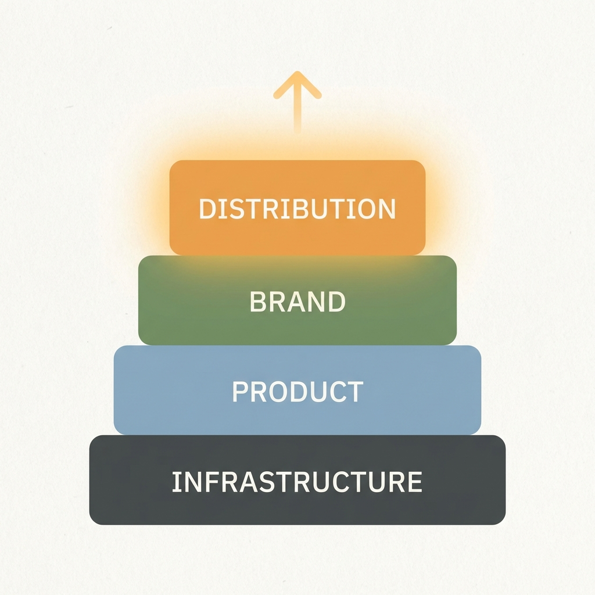
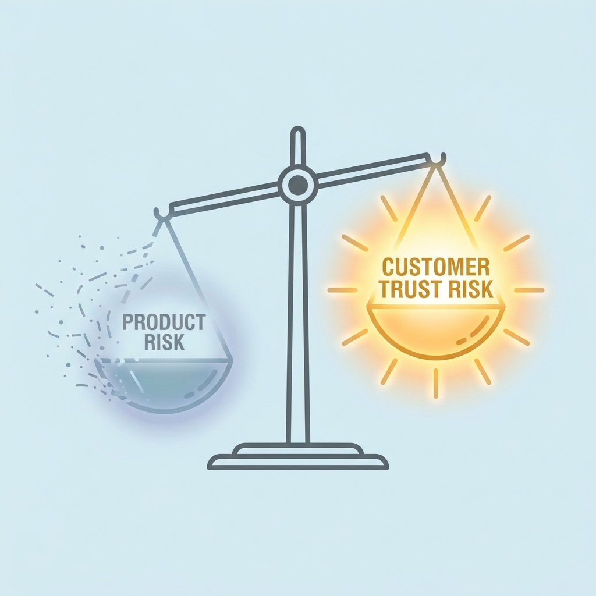
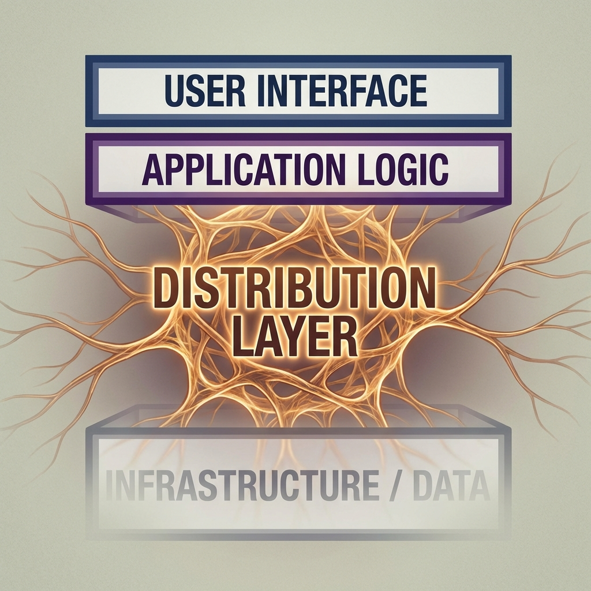
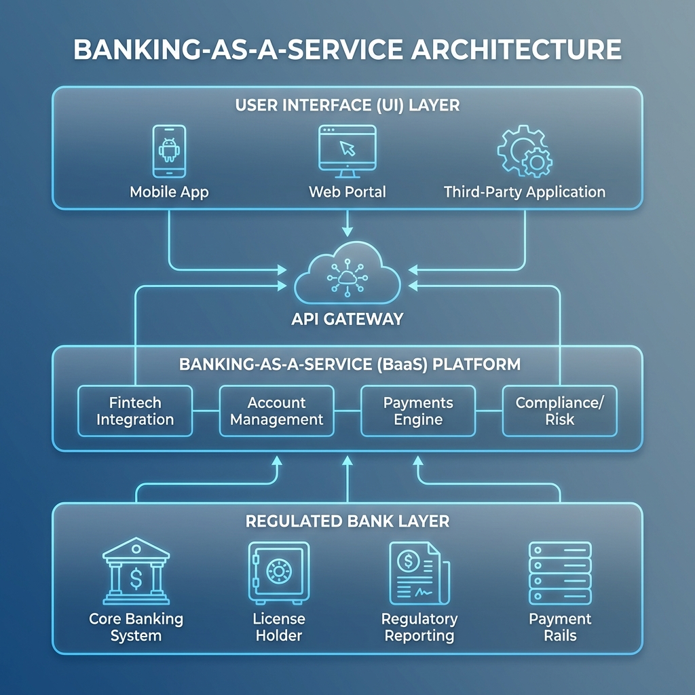

# White Labeling: The Shortcut That Teaches You More Than It Pays

## Introduction — The Comfortable Lie

White labeling is often sold as a shortcut.

> “Launch fast.”  
> “No tech needed.”  
> “Focus on marketing.”

All true — and still misleading.

White labeling doesn’t eliminate risk.  
It **reassigns risk** from building products to **owning trust, distribution, and dependency**.

This post isn’t arguing for or against white labeling.  
It’s about understanding **what it’s actually good for** — and why most founders misuse it.

---

## What White Labeling Really Is

The surface definition is simple:

> Selling someone else’s product under your brand.

A more useful mental model:

> **White labeling = outsourcing product risk while fully owning customer risk.**

You avoid:
- Engineering complexity  
- Infrastructure scaling  
- Regulatory depth (sometimes)

But you inherit:
- Customer expectations  
- Support pressure  
- Reputation damage  
- Dependency on someone else’s roadmap  

When things break, users don’t blame your supplier.  
They blame **you**.

---

## The Hidden Stack Behind Every White-Labeled Business

Every white-labeled company quietly operates on four layers:

1. **Core Product (Not Yours)**  
   Software, APIs, factories, logistics, infrastructure.

2. **Branding & UX (Underrated)**  
   Naming, onboarding, positioning, tone — usually rushed.

3. **Distribution (The Only Compounding Asset)**  
   SEO, ads, sales, partnerships, communities.

4. **Customer Relationship (The Real Work)**  
   Support, refunds, reassurance, trust repair.

Most founders think they’re building **Layer 1**.  
In reality, they’re only allowed to compete in **Layers 3 and 4**.

---

## White Labeling in the Wild — Real Examples Across Industries

---

### SaaS & Developer Platforms

**Twilio**  
Thousands of startups built SMS, OTP, and voice products entirely on Twilio.

- Twilio stayed invisible  
- Founders focused on sales and UX  
- When Twilio raised prices, margins collapsed overnight  

**Lesson:**  
White labeling works — until the infrastructure provider reclaims leverage.

---

**Stripe**  
Many SaaS products “sell payments,” but Stripe:
- Handles compliance  
- Manages fraud  
- Owns the financial rails  

Over time, Stripe moved **up the stack** with Billing, Atlas, and Identity — directly competing with some customers.

**Pattern:**  
Infrastructure providers always have the option to become the product.

---

### E-Commerce & Consumer Brands

**Amazon Basics**  
Amazon analyzed third-party sellers and then:
- White-labeled top-selling products  
- Used logistics and trust advantage  
- Priced aggressively  

This is **reverse white labeling** — the platform eats the reseller.

**Lesson:**  
If you don’t own distribution, someone who does can replace you.

---

**Indian D2C Brands (Skincare, Nutrition, Fashion)**  
Many fast-growing brands:
- Use the same manufacturers  
- Share near-identical formulations  
- Compete mainly on Instagram storytelling  

**Reality:**  
Early differentiation comes from **brand and distribution**, not product originality.

---

### FinTech & Embedded Finance

Most neobanks are:
- UI + onboarding + marketing  
- Built on licensed banks and BaaS providers  

When regulations tightened in India:
- Several fintechs froze overnight  
- The dependency risk became visible  

**Truth:**  
White-labeled finance is powerful — and extremely fragile.

---

### EdTech & Corporate Learning

White-label LMS platforms power:
- Corporate training portals  
- Coaching institutes  
- Internal upskilling tools  

Buyers rarely ask:

> “Who built this platform?”

They ask:
- Does it work reliably?  
- Can you support us?  
- Can you customize reports?  

**Insight:**  
Outcomes beat originality.

---

### Mobility, Logistics & Infra

Early-stage startups often:
- White-label fleet software  
- Use generic logistics APIs  
- Differentiate only on partnerships  

Most never escape this phase.

**Why?**  
They optimize for speed — not control.

---

## The Three White Label Traps

### Trap 1: “We’ll Build Our Own Later”
Later almost never comes.

Cash flow creates comfort.  
Comfort kills urgency.

---

### Trap 2: Thin Margins, High Stress
White-label businesses often have:
- 10–30% gross margins  
- Heavy support overhead  
- Constant price pressure  

You work harder than SaaS founders — with less leverage.

---

### Trap 3: Supplier Fragility
If your upstream provider:
- Changes pricing  
- Alters terms  
- Enters your market  

Your business can collapse **without warning**.

---

## When White Labeling Is Actually Smart

White labeling works when used **intentionally**.

### As a Distribution Test  
Can you acquire customers cheaply?  
Can you earn trust?  
Can you retain users?

If yes — that’s signal.

---

### As a Wedge  
Start generic → go niche → add proprietary workflows.  
Over time, the white-labeled core becomes invisible.

---

### As a Cash Engine (Rare, Disciplined)  
Some founders use white labeling to:
- Fund a bigger vision  
- Buy time to build real IP  

This only works with a **clear exit plan**.

---

## The Question Every Founder Must Answer

> **If my supplier disappears tomorrow, what do I still own?**

If the answer isn’t:
- Distribution  
- Brand trust  
- Customer insight  

You don’t have a business.  
You have **temporary access**.

---

## Final Thought

White labeling isn’t cheating.  
It’s **training**.

But training only helps if:
- You know what skill you’re developing  
- You know when to stop practicing and start building  

Used wrongly, white labeling delays real work.  
Used correctly, it teaches you **exactly what to build next**.
